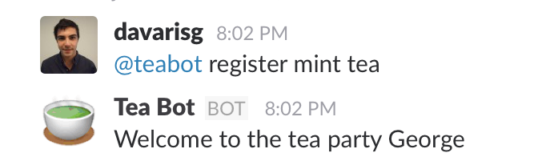
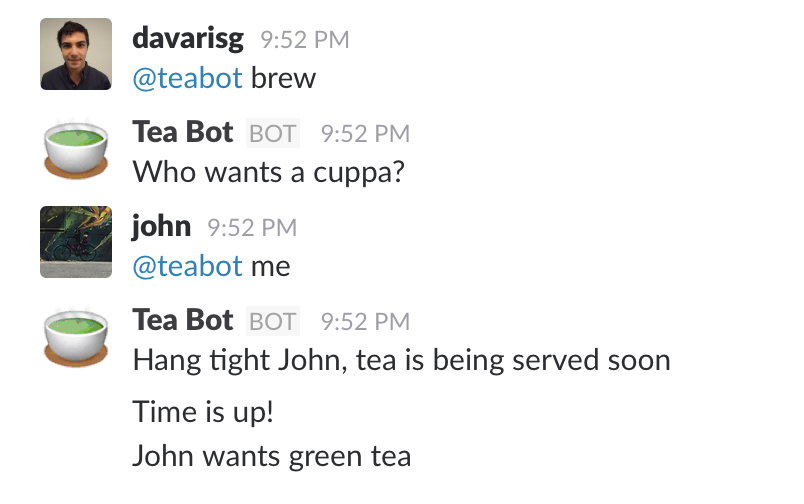
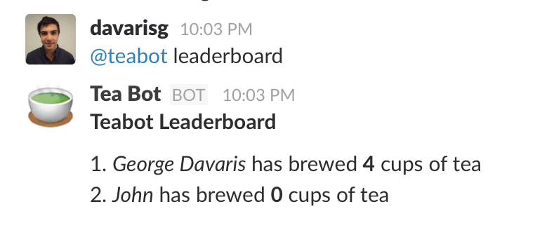
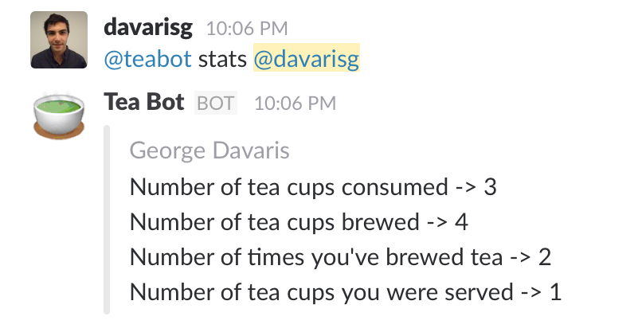

# Slack Tea Bot

A tea bot for Slack.

## Available Commands ##

1. _register_ - Registers the tea preference of a user (`@teabot register green tea`)

2. _brew_ - Initiates the brewing process (users have 120 seconds to respond) (`@teabot brew`)
3. _me_ - Reply with `@teabot me` when someone has offered to brew

4. _leaderboard_ - Displays the current leaderboard based on tea cups brewed (`@teabot leaderboard`)

5. _stats_ - Displays the stats for all users (`@teabot stats`) or (`@teabot stats @george`) for a single user

6. _nominate_ - Nominate someone to brew tea. You must brew tea more than %s times to use this (`@teabot nominate @george`)

## How to run the app ##

* Go to Slack's App & Integrations > Manage > Custom Integrations and add a new Bot called teabot.
* Create a virtualenv and load it.
* On the repository's root type `pip install -r requirements.txt`.
* Install Redis server and start it. Celery tries to connect to `redis://localhost:6379`. You can configure that in [conf.py](src/conf.py).
* Export your slack secret key `export SLACK_WEBHOOK_SECRET="mysecretslackkey"`.
* Initialize the database `python init_db.py`. You can configure the path to the sqlite DB in [conf.py](src/conf.py).
* Start the celery workers `cd src && celery -A tasks worker -B`.
* Start the app `python src/app.py`.

## How to run tests locally ##

* Load your virtualenv.
* Install test required pip packages `pip install -r requirements_test.txt`.
* From the repository's root type `python -m unittest discover`.
